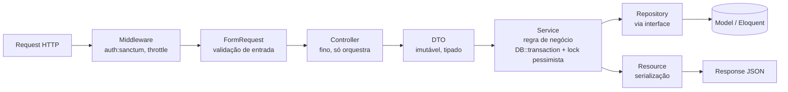
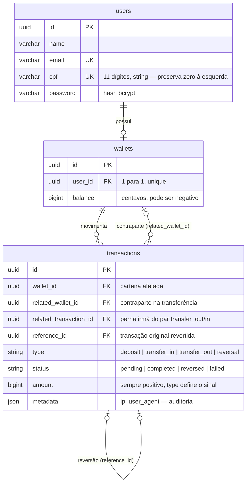

# Carteira Financeira

Carteira digital construída com Laravel + React — depósitos, transferências
e reversões com ledger imutável, lock pessimista e auditoria completa.


## Como rodar

```bash
git clone https://github.com/antoniomartins13/laravel-wallet.git
cd laravel-wallet
cp backend/.env.example backend/.env
docker compose up -d --build
docker compose exec app php artisan migrate --seed
```

Pronto. Backend em `http://localhost:8080`, frontend em
`http://localhost:5173`, Telescope em `http://localhost:8080/telescope`.

O `--seed` cria dois usuários de demonstração (senha `password` para os
dois):

| E-mail | Saldo inicial |
|---|---|
| `alice@example.com` | R$ 1.000,00 |
| `bob@example.com` | R$ 0,00 |

## Arquitetura

### Fluxo de uma requisição de escrita (depósito, transferência, reversão)



Controllers nunca decidem nem abrem transação de banco — só orquestram.
Services dependem de interfaces de Repository (`WalletRepositoryInterface`,
`TransactionRepositoryInterface`), nunca de Eloquent direto, o que permite
testar a orquestração de negócio com mocks, sem tocar banco
(`tests/Unit/Services/DepositServiceTest.php`).

### Modelo de dados



Ledger imutável: nenhuma linha de `transactions` é alterada ou apagada.
Reverter é sempre uma nova linha `type: reversal` apontando pra original via
`reference_id` — ver [ADR-0012](docs/adr/0012-ledger-imutavel.md).

### Estrutura do backend (`backend/app/`)

```
app/
├── DTOs/            DepositDTO, TransferDTO, ReversalDTO — imutáveis, atravessam as camadas
├── Enums/           TransactionType, TransactionStatus — backed enums nativos
├── Exceptions/      ApplicationException (base) + 4 exceptions de domínio
├── Http/
│   ├── Controllers/ Deposit, Transfer, Reversal, Statement, Wallet + Auth/ (Breeze)
│   ├── Requests/    FormRequests (validação; nunca no Controller)
│   └── Resources/   TransactionResource, WalletResource
├── Models/          User, Wallet, Transaction
├── Policies/        TransactionPolicy (quem pode reverter)
├── Providers/       RepositoryServiceProvider (bind interface → implementação)
├── Repositories/     Contracts/*Interface.php + implementações Eloquent
├── Rules/           ValidCpf (dígito verificador)
└── Services/        Deposit, Transfer, Reversal, Statement — regra de negócio
```

## Decisões técnicas

16 ADRs em [`docs/adr/`](docs/adr/), incluindo:

| Decisão | ADR |
|---|---|
| Dinheiro como inteiro (centavos), nunca float | [0008](docs/adr/0008-dinheiro-em-centavos.md) |
| UUID como chave primária (não enumerável) | [0010](docs/adr/0010-uuid-como-chave-primaria.md) |
| Ledger imutável — reversão é novo registro, nunca UPDATE | [0012](docs/adr/0012-ledger-imutavel.md) |
| Saldo materializado + ledger como fonte de verdade | [0013](docs/adr/0013-saldo-materializado-mais-ledger.md) |
| Lock pessimista com ordenação determinística (evita deadlock) | [0014](docs/adr/0014-lock-pessimista-ordenacao-deterministica.md) |
| Camadas DTO → Service → Repository (e por que a interface) | [0015](docs/adr/0015-camadas-dto-service-repository.md) |
| Sanctum SPA com cookies (não token em localStorage) | [0003](docs/adr/0003-autenticacao-sanctum-spa-cookies.md) |

## Testes

```bash
docker compose exec app php artisan test
# ou nativo, se tiver PHP 8.4 local (bem mais rápido):
cd backend && php artisan test
```

**65 testes, 159 assertions, 90.8% de cobertura** (SQLite `:memory:`,
suíte roda em segundos — ver [ADR-0006](docs/adr/0006-mysql-runtime-sqlite-testes.md)):

```
DTOs/*, Enums/*, Exceptions/*, Rules/ValidCpf ............... 100.0%
Http/Controllers/{Deposit,Transfer,Reversal,Statement,Wallet}  100.0%
Http/Requests/{Deposit,Transfer,RegisterUser} ................ 100.0%
Http/Resources/* ............................................. 100.0%
Policies/TransactionPolicy ................................... 100.0%
Repositories/* (contracts + implementações) .................. 100.0%
Services/{Deposit,Statement,Transfer} ........................ 100.0%
Services/ReversalService ...................................... 98.7%
Models/{User,Wallet,Transaction} ....................... 60–100%
Auth/* (scaffold do Breeze, parcialmente coberto pelos testes) . 0–85%
──────────────────────────────────────────────────────────────
Total .......................................................  90.8%
```

O requisito-chave do desafio ("saldo negativo por algum motivo, depósito
deve acrescentar") tem teste dedicado:
`test_deposit_is_added_even_when_the_balance_is_negative` — e o cenário
completo de reversão deixando saldo negativo também:
`test_reversal_of_a_transfer_can_leave_the_recipients_balance_negative`.

## Rotas da API

Autenticação (cookie-based, Sanctum SPA):

| Método | Rota | Descrição |
|---|---|---|
| POST | `/register` | Cadastro (CPF validado, cria wallet automaticamente) |
| POST | `/login` | Login |
| POST | `/logout` | Logout |
| POST | `/forgot-password` | Solicita link de redefinição de senha |
| POST | `/reset-password` | Redefine senha |
| GET | `/verify-email/{id}/{hash}` | Confirma verificação de e-mail |
| POST | `/email/verification-notification` | Reenvia e-mail de verificação |

API (`auth:sanctum` obrigatório):

| Método | Rota | Descrição |
|---|---|---|
| GET | `/api/user` | Usuário autenticado |
| GET | `/api/wallet` | Saldo da carteira do usuário |
| GET | `/api/wallets/lookup` | Busca destinatário por e-mail/CPF (nunca expõe saldo de terceiros) |
| GET | `/api/transactions` | Extrato paginado (`?page=`, `?per_page=`) |
| POST | `/api/deposits` | Depósito |
| POST | `/api/transfers` | Transferência |
| POST | `/api/transactions/{id}/reversal` | Reversão (só participantes da transação) |

Rotas de escrita (`deposits`, `transfers`, `reversal`) e `/login` têm
`throttle` dedicado — ver checklist de segurança.

## Observabilidade

- **Telescope** (`/telescope`, só ambiente `local`): queries, requests,
  exceptions, jobs. Gate vazio em produção = ninguém acessa fora de `local`
  — [ADR-0004](docs/adr/0004-telescope-somente-desenvolvimento.md).
- **Log financeiro dedicado** (`storage/logs/financial-*.log`, JSON, 90
  dias de retenção): toda operação monetária — completa ou rejeitada — com
  `transaction_id`, `wallet_id`, `amount` e `result`. Ex.: saldo
  insuficiente numa transferência gera `transfer.rejected` com
  `reason: insufficient_balance`, sem nunca poluir o log de erro geral
  (essas são exceções de domínio esperadas, não bugs).
- **Coluna `metadata`** em toda transação (depósito, transferência,
  reversão): IP e user-agent de quem fez a requisição — trilha de
  auditoria completa.

## Segurança

- [x] Sanctum SPA: cookie `httpOnly` + proteção CSRF — XSS não rouba sessão
- [x] Bcrypt para senhas (default Laravel)
- [x] Validação server-side em FormRequests — nunca confia no front
- [x] Autorização de carteira: em depósito/transferência/extrato, a
      carteira é **sempre** derivada de `$request->user()->wallet` — nunca
      aceita um `wallet_id` de terceiro como entrada, então não há Policy a
      contornar. Reversão é o único caso onde outra pessoa pode ser
      afetada (a contraparte da transferência), e usa uma `Policy` real
      (`TransactionPolicy::reverse`)
- [x] Rate limiting: `throttle:financial` (depósitos/transferências/
      reversões) + `throttle:login` (por IP, complementa o limite por
      e-mail do próprio Breeze)
- [x] Mass assignment protegido (`#[Fillable]`)
- [x] SQL injection: só Eloquent/query builder, zero SQL concatenado
- [x] UUIDs não enumeráveis nas URLs
- [x] Telescope restrito a ambiente local

## Frontend

React 19 + TypeScript + Tailwind v4, autenticação via cookies (sem token em
localStorage), React Query com invalidação de cache + polling (saldo
atualiza sozinho quando alguém te transfere dinheiro, sem WebSocket).
Design system documentado em
[`.claude/skills/design-system/SKILL.md`](.claude/skills/design-system/SKILL.md).
